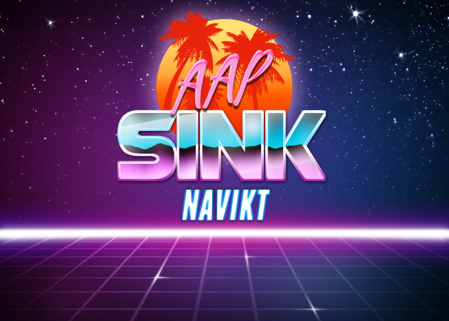
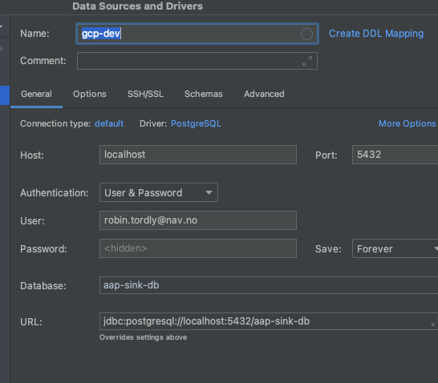

Leser kafka topic med søkere og dumper det ned i database.

Topic `aap.sokere.v1` &nbsp;&nbsp;&nbsp;&nbsp;
Definition [topic-søkere.yml](https://github.com/navikt/aap-vedtak/blob/main/.nais/topic-s%C3%B8kere.yml)

## Connect to PostgreSQL
Ref script: [connect](tools/connect)
```shell
tools/connect your.name@nav.no
```
Token is copied to clipboard, use it as db password.
The connect script uses a [proxy](tools/cloud_sql_proxy) to make it available with **localhost**.
NB! make sure you dont occupy the port **5432** with e.q a docker image of postgres already.

**Connect with IDEA**


